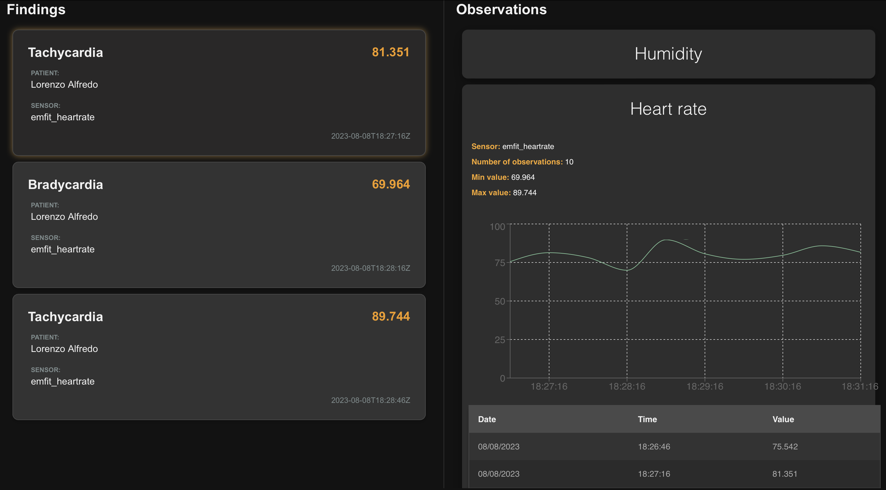

# AAL System
Ontology-Based Health Monitoring System For Ambient Assisted Living

## Description

The goal of this system is to be a semantic connector between Smart Home IoT data and a Health ontology.
Enabling SPARQL queries to be smartly performed with the reasoning engine, providing information for a better AAL management.

### System Architecture


### Web UI


## System capabilities:

- [X] Connects to Home Assistant (Smart Home)
- [X] Request entities state from Home Assistant
- [X] Connects to Apache Jena Fuseki (SPARQL Server)
- [X] Queries SPARQL Server
- [X] Dockerize Apache Jena Fuseki Server
- [X] Add Openllet Reasoner to Apache Jena Fuseki Server
- [X] Add SWRL Rules to Apache Jena Fuseki Server
- [X] Websocket connection to Home Assistant
- [X] Load initial state from all sensors
- [X] Add observation to Fuseki via SPARQL Query when state changes
- [X] Query triggers activated by the SWRL rules reasoning
- [X] Serve websocket API to allow client connection
- [X] Serve findings via websocket API
- [X] Serve observations via websocket API
- [X] Web UI to display the findings
- [X] Web UI to display the observations
- [ ] Insert SWRL rules in Fuseki via REST API
- [X] Dockerize AAL System
- [X] Build a docker compose to run the AAL System

## Using

### Pre-requisites to Development
- [Docker](https://docs.docker.com/engine/install/)
- [docker-compose](https://docs.docker.com/compose/install/)
- [Task](https://taskfile.dev/#/installation)
- [Go](https://golang.org/doc/install)
- [Home Assistant](https://www.home-assistant.io/docs/installation/)
  - Should be running (usually in a Raspberry Pi) in the same network as this machine 
  - Should have the [RESTful API](https://www.home-assistant.io/integrations/rest/) enabled
- [Node.js](https://nodejs.org/en/download/)

### Environment variables

```bash
HASSIO_TOKEN=<your home assistant token>
```

##

### Build

```bash
docker-compose build
```

### Run

```bash
docker-compose up
```

### Delete

```bash
docker-compose down
```
