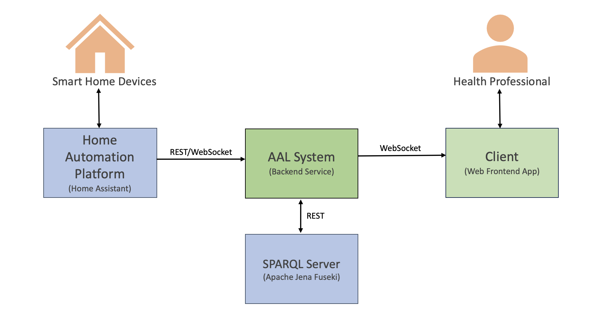

# AAL System
Ontology-Based Health Monitoring System For Ambient Assisted Living

## Description

The goal of this system is to be a semantic connector between Smart Home IoT data and a Health ontology.
Enabling SPARQL queries to be smartly performed with the reasoning engine, providing information for a better AAL management.



## System capabilities:

- [X] Connects to Home Assistant (Smart Home)
- [X] Request entities state from Home Assistant
- [X] Connects to Apache Jena Fuseki (SPARQL Server)
- [X] Queries SPARQL Server
- [ ] CRUD of instances/data in RDF graph database
- [ ] Add/Remove SPARQL queries
- [ ] Run SPARQL queries regularly
- [ ] Run queries only when sensor data changed
- [ ] Build a docker compose to run the Apache Jena Server and the AAL System
- [ ] Serve REST api to allow client connection

## Using

### connect the machine in the same network as Home Assistant 
  - Home Assistant API should be enabled

### run Apache Jena Fuseki server with the SNOMED CT ontology
  - ```docker build -t fuseki -f fuseki.Dockerfile .```
  - ```docker run -p 3030:3030 fuseki```

### run the AAL system
  - ```go run main.go```